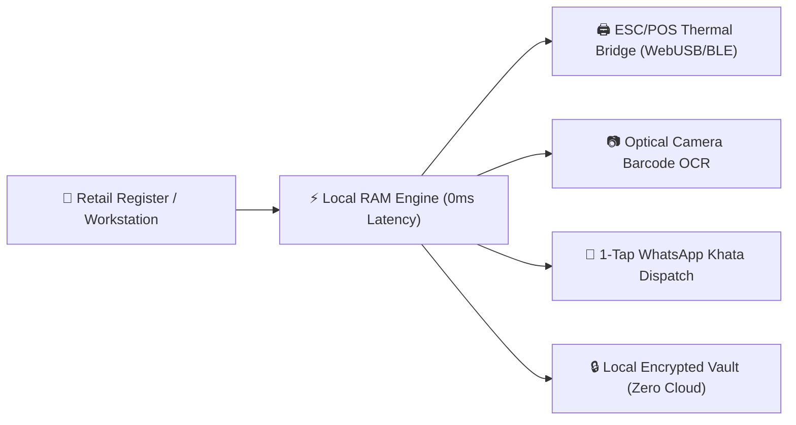

<div align="center">

  

  # BillMaster97™ Enterprise Suite
  ### Sovereign Commercial Invoicing, Touch Speed POS & ESC/POS Thermal Bridge

  <p align="center">
    <b>A high-performance, 100% offline-first commercial billing workstation engineered for total data sovereignty.</b><br>
    Eliminates recurring monthly POS subscription fees, cloud downtime, and ISP blackouts.
  </p>

  <p align="center">
    <a href="https://billmaster97.com"></a>
    <a href="https://billmaster97.com/app/"></a>
    <a href="https://billmaster97.com/#pricing"></a>
    <a href="https://www.linkedin.com/in/narayan-modak/"></a>
  </p>

  <p align="center">
    
    
    
    
    
  </p>

  ---

  <p align="center">
    <a href="#-executive-summary">Executive Summary</a> •
    <a href="#-architectural-pillars">Core Architecture</a> •
    <a href="#-commercial-modules">Modules</a> •
    <a href="#-hardware-compatibility-matrix">Hardware Matrix</a> •
    <a href="#-tax--regulatory-compliance">Compliance</a> •
    <a href="#-commercial-licensing-tiers">Licensing</a> •
    <a href="#-leadership--lead-architect">Leadership</a>
  </p>

</div>

---

## 📋 Executive Summary

Traditional retail Point-of-Sale (POS) software vendors lock merchants into coercive SaaS subscriptions ranging from **$99 to $299 per month ($1,200 to $3,500+ annually)**, while maintaining central control over transaction data. When internet connections fail or vendor servers crash during peak holiday rush hours, cash registers halt and sales are lost.

**BillMaster97™** was architected to solve this failure mode permanently.

By pairing modern browser standards (WebUSB, Web Bluetooth, Optical OCR Barcode Decoding, and Client-Side Cryptographic Storage) with local in-memory calculation routines, BillMaster97 executes commercial billing workflows with **0 ms cloud latency**, **100% offline survivability**, and **zero mandatory server maintenance charges**.

```
┌────────────────────────────────────────────────────────────────────────┐
│                        BILLMASTER97 ARCHITECTURE                       │
├────────────────────────────────┬───────────────────────────────────────┤
│ Traditional Cloud POS Systems  │ BillMaster97 Sovereign Suite          │
├────────────────────────────────┼───────────────────────────────────────┤
│ ❌ $1,200 - $3,500 / year fees │ ✅ $0 Monthly Subscription (Lifetime) │
│ ❌ Freezes when internet drops │ ✅ Works 100% offline (0 ms latency)  │
│ ❌ Vendor holds financial data │ ✅ 100% Private local encrypted RAM  │
│ ❌ Expensive proprietary gear  │ ✅ Direct ESC/POS WebUSB & Bluetooth  │
│ ❌ Slow print dialog spooling  │ ✅ 0.02s Instant thermal printing     │
└────────────────────────────────┴───────────────────────────────────────┘
```

---

## ⚡ Core Architectural Pillars



### 1. ⚡ Sovereign Offline-First Engine
* **Pure Client-Side Computation:** Executes cart totals, dynamic split-taxes, per-item percentage discounts, and change calculations entirely in workstation memory.
* **Zero Internet Dependency:** Operates seamlessly in underground basements, high-altitude locations, rural outposts, or during severe ISP disruptions.

### 2. 🖨️ Direct Hardware Thermal Bridge (WebUSB & Web Bluetooth)
* Eliminates standard browser print dialog delays through direct serial byte-stream communication via **ESC/POS** protocols.
* Supports **58mm (2-inch)** and **80mm (3-inch)** continuous thermal roll printing with automated hardware paper cut pulses and cash drawer kick-out triggers.

### 3. 📷 Optical OCR Camera Barcode Scanner
* Turns any standard workstation webcam, tablet camera, or smartphone sensor into an instant inventory lookup scanner without requiring external USB laser hardware.
* Real-time multi-format decoder supporting **EAN-13**, **UPC-A**, **Code-128**, **Code-39**, and **QR Codes**.

### 4. 💬 WhatsApp Delivery Engine & Digital Khata Ledger
* 1-tap dispatch of itemized receipts directly to customer WhatsApp accounts with formatted invoice totals and instant PDF download links.
* Integrated aging debt radar (**1–15 Days**, **16–30 Days**, and **31+ Days Overdue**) with automated 1-click balance recovery reminders.

### 5. 🔒 Cashier PIN & Wholesale Margin Cloaking
* Secures store profitability with 4-digit Cashier Access PINs that conceal master purchase cost rates and gross profit margins on customer-facing screens.

---

## 🧩 Comprehensive Commercial Modules

| Module | Purpose | Target Businesses |
| :--- | :--- | :--- |
| **Touch Speed POS** | Visual color-coded product grid, quick-tender cash chips, rapid multi-cart hold | Supermarkets, Retail Cafes, QSRs |
| **Optical OCR Scanner** | Camera-based barcode lookup, automatic inventory decrementing | Convenience Stores, Boutiques |
| **Thermal ESC/POS Bridge** | Direct 58mm/80mm printer spooling without system printer drivers | Grocery Stores, Bakeries, Food Trucks |
| **WhatsApp Dispatch** | Paperless digital bill distribution, PDF links, and QR payment codes | Modern Retailers, Service Firms |
| **Dead Stock Radar** | Visual aging stock analysis, capital decay prevention, restock alerts | Wholesale Warehouses, Distributors |
| **Customer Khata CRM** | Credit/debit ledger balances, customer credit limits, statement logs | Neighborhood Grocers, Trade Suppliers |
| **Multi-Tax Engine** | Simultaneous split GST, VAT, Service Tax, and Local Cess computation | Global Importers, Multi-Region Retail |
| **Bulk CSV Importer** | Instant ingestion of 5,000+ SKU inventory catalogs in under 20 seconds | Supermarkets, Hardware Stores |
| **Local P2P Data Sync** | LAN-based offline database backup and workstation cloning | Multi-Lane Stores, Department Chains |

---

## 🖨️ Hardware Compatibility Matrix

BillMaster97 is vendor-agnostic and pairs directly with industry-standard POS hardware:

| Hardware Type | Supported Protocols | Certified Models |
| :--- | :--- | :--- |
| **Thermal Receipt Printers (80mm)** | ESC/POS via USB, Bluetooth, Network (Raw 9100) | Epson TM-T82, TVS RP3200, Everycom, Star TSP100, Rongta RP326 |
| **Thermal Receipt Printers (58mm)** | ESC/POS via Web Bluetooth, WebUSB | Everycom 58mm, GOOJPRT, Zjiang 5802, Mini Bluetooth Terminals |
| **Barcode & QR Scanners** | HID Keyboard Wedge, Virtual COM, WebCam OCR | Honeywell Voyager, Zebra DS2208, Inateck, Any HD Web Camera |
| **Cash Drawers** | 24V / 12V Solenoid via RJ11/RJ12 Printer Kick | Posiflex, APG Cash Drawer, Generic Heavy-Duty Steel Drawers |
| **Electronic Weighing Scales** | Serial RS-232 / USB HID (Standard Format) | Essae, Mettler Toledo, Phoenix, Generic POS Bench Scales |

---

## 🌍 Tax & Regulatory Compliance

Engineered to fulfill invoicing regulations across **44 countries and territories**:

* 🇮🇳 **India:** Standard GST compliance (CGST, SGST, IGST, UTGST), mandatory HSN/SAC code classification, B2B reverse charge, and dynamic UPI QR codes.
* 🇬🇧 / 🇪🇺 **United Kingdom & European Union:** Standard 20%, Reduced, and Exempt VAT layouts, Reverse Charge notes, and business VAT identification printing.
* 🇺🇸 **United States:** Configurable state, county, and municipal sales taxes with itemized exemption categorizations.
* 🇦🇪 / 🇸🇦 **Middle East (GCC):** ZATCA Phase 1 & 2 compliant dynamic Base64 TLV QR generation, bilingual English/Arabic receipt layouts.
* 🇨🇦 **Canada:** Dual split GST/HST/PST/QST computation for all Canadian provinces.
* 🇦🇺 **Australia & New Zealand:** ATO-compliant 10% GST tax invoices with ABN/NZBN business identification.

---

## 💎 Commercial Licensing Tiers

All BillMaster97 licenses are **one-time purchases with lifetime commercial usage rights**. No recurring renewal fees, no server surcharge, and no forced upgrades.

```
┌─────────────────────────┬──────────────────────────┬─────────────────────────┐
│       PRO EDITION       │    ENTERPRISE SUITE      │     CORPORATE FLEET     │
│       $199.00 USD       │       $499.00 USD        │       $999.00 USD       │
├─────────────────────────┼──────────────────────────┼─────────────────────────┤
│ • 1 Workstation License │ • 5 Workstation Licenses │ • 12 Workstations / Hub │
│ • Touch Speed POS       │ • Full Inventory Radar   │ • Multi-Store Deploy    │
│ • Thermal ESC/POS (80mm)│ • Staff Margin Cloaking  │ • Priority Direct Line  │
│ • WhatsApp Billing      │ • Bulk CSV Catalog Sync  │ • Custom Formats Support│
│ • Lifetime Offline Use  │ • Lifetime Enterprise    │ • Fleet License Master  │
└─────────────────────────┴──────────────────────────┴─────────────────────────┘
```

*Commercial checkout, instant license key generation, and VAT receipts are managed securely by our Merchant of Record, **Lemon Squeezy** (Stripe Express infrastructure, supporting Visa, Mastercard, AMEX, Apple Pay, Google Pay, and UPI).*

🔗 **[Order Lifetime Commercial License](https://billmaster97.com/#pricing)**

---

## 👨‍💼 Leadership & Lead Architect

<table border="0">
  <tr>
    <td width="110" valign="top">
      
    </td>
    <td valign="top">
      <h3>Narayan Modak</h3>
      <p><b>Founder & Lead Software Architect — BillMaster97</b></p>
      <p>
        Architected BillMaster97 with a singular commitment: delivering uncompromising software sovereignty, sub-millisecond execution speeds, and complete offline autonomy to retail merchants globally.
      </p>
      <p>
        👔 <b>LinkedIn:</b> <a href="https://www.linkedin.com/in/narayan-modak/">linkedin.com/in/narayan-modak</a><br>
        ✉️ <b>Official Support:</b> <a href="mailto:support@billmaster97.com">support@billmaster97.com</a><br>
        📍 <b>Registered Location:</b> Vill: Mallikpur, PO & PS: Mandir Bazar, Dist: South 24 Parganas, West Bengal, PIN: 743395, India
      </p>
    </td>
  </tr>
</table>

---

## 🔒 Security, Privacy & Integrity Attestation

1. **Zero Cloud Telemetry:** BillMaster97 transmits zero financial records, transaction items, or customer lists to any remote tracking server.
2. **Client-Side Data Storage:** All customer khata logs, sales histories, and inventory databases are encrypted and stored solely within the local browser sandbox (`IndexedDB`).
3. **Regulatory Privacy Adherence:** Compliant with the General Data Protection Regulation (**GDPR**), California Consumer Privacy Act (**CCPA**), and the Indian Digital Personal Data Protection Act (**DPDP**).

---

## 📌 Repository Notice & Verification

This public repository functions as the official **Project Registry, Architecture Blueprint, and Documentation Hub** for the BillMaster97 commercial suite.

* **To test the live application:** Visit [https://billmaster97.com/app/](https://billmaster97.com/app/) (Free instant access, zero registration required).
* **For technical manuals & ESC/POS pairing guides:** Visit [https://billmaster97.com/guide.html](https://billmaster97.com/guide.html).
* **For volume licensing & commercial inquiries:** Contact [support@billmaster97.com](mailto:support@billmaster97.com).

<div align="center">
  <sub>© 2026 BillMaster97 Enterprise Suite. Architected with Sovereign Integrity by Narayan Modak. All Rights Reserved.</sub>
</div>
